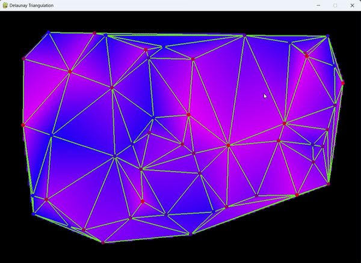

# Delaunay-Triangulation-Pygame

The code is based on [this](https://gorillasun.de/blog/bowyer-watson-algorithm-for-delaunay-triangulation/) article.

## Overview

Delaunay Triangulation implemented in python and solved using Bowyer-Watson algorithm.

  

